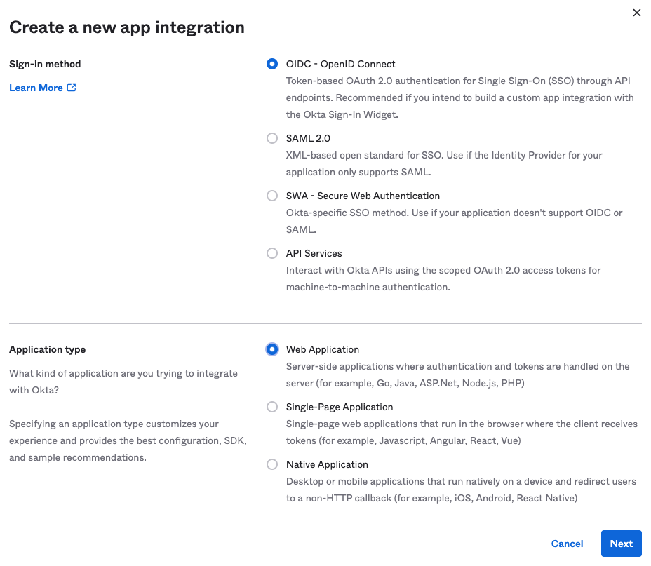
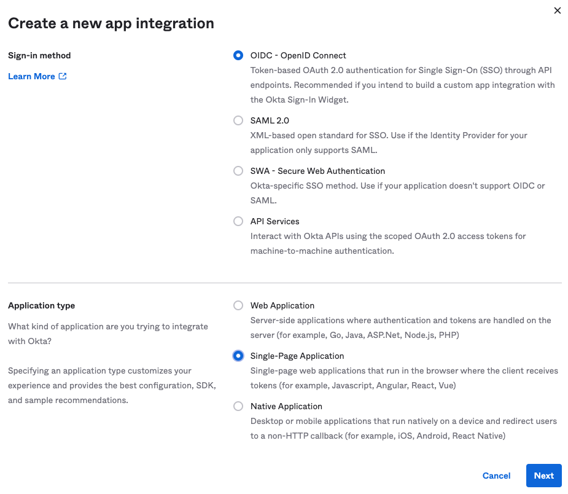
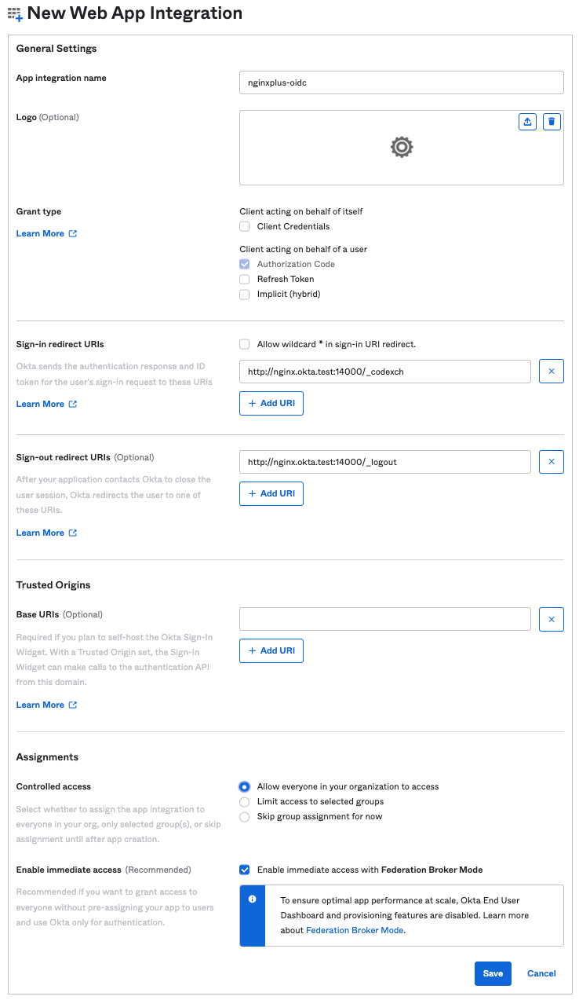
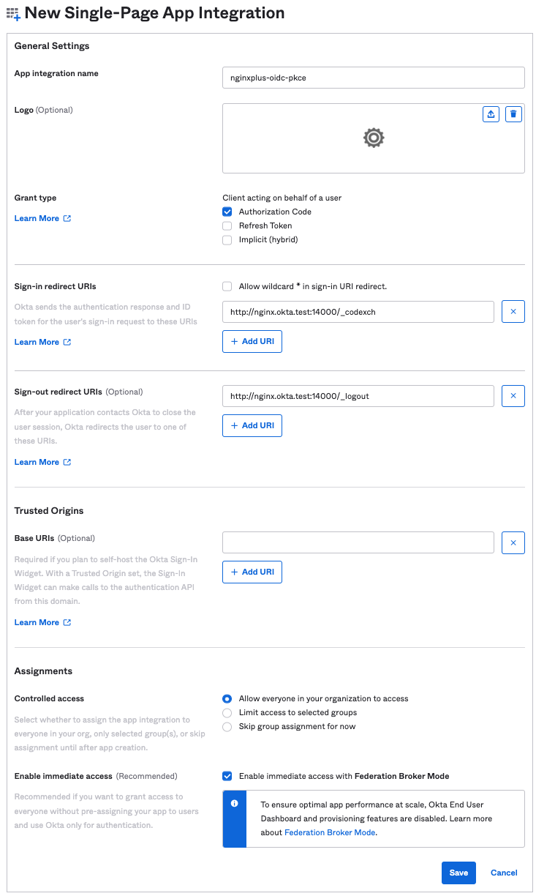
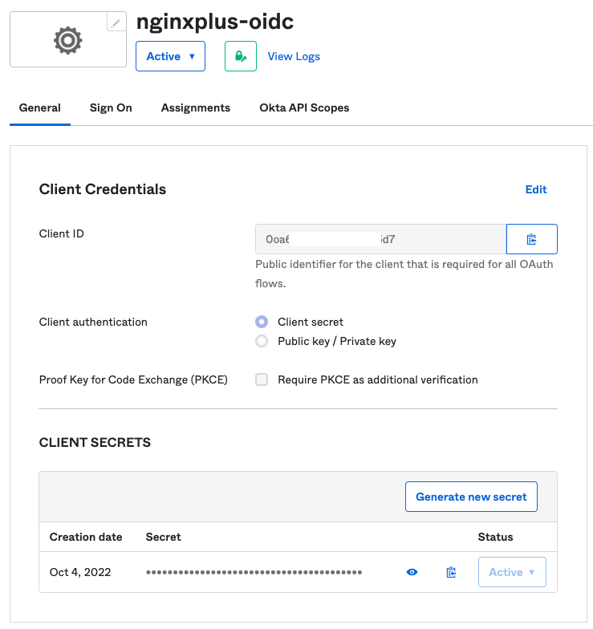
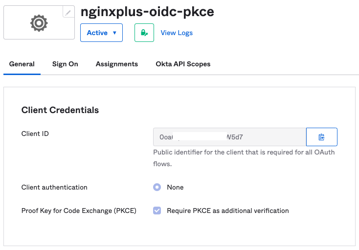

# How To Configure Okta for NGINX Plus OIDC Integration

Take the following steps to create a new application of Okta for integrating with NGINX Plus.

> **Note:**
>
> This section contains images that reflect the state of the Okta web interface at the time of publication. The actual Okta GUI may differ from the examples shown here. Use this guide as a reference and adapt the instructions to suit the current Okta GUI as necessary.

This section describes the Okta Workforce Identity SSO product. You will need administrator access to your organization in Okta to complete this task. Your experience may differ somewhat if you’re using the Okta Customer Identity product.

- [Create a New Okta Web Application](#create-a-new-okta-web-application)
- [Set up the Web App Integration](#set-up-the-web-app-integration)
- [Get the Okta App Client Credentials](#get-the-okta-app-client-credentials)
- [Manage Access to your Okta Application](#manage-access-to-your-okta-application)

## Create a New Okta Web Application

1. Log in to Okta at [okta.com](https://www.okta.com/).

2. Select the **Admin** button next to your username to access the Admin console.

3. On your Admin dashboard, select **Applications** in the left-hand navigation menu.

4. On the Applications page, select the **Create App Integration** button.

5. In the **Create a new app integration** window, define the following values, then select **Next**:

   - **Sign-in method**: OIDC - OpenID Connect

   - **Application type**:

     - Option 1. Check `Web Application` if you want to **disable PKCE**

       

     - Option 2. Check `Single-Page Application` if you want to **enable PKCE**

       

## Set up the Web App Integration

On the **New Web App Integration** page in the Okta web interface, fill in the following information, then select **Save**.

- **App integration name**

  - The name of the OpenID Connect relying party.
  - Okta refers to this as the “application”.
  - **Example Value**:
    - `nginxplus-oidc`: for none PKCE
    - `nginxplus-oidc-pkce`: for PKCE

- **Sign-in redirect URIs**

  - The URI of the NGINX Plus instance
    - including the port number
    - ending in `/_codexch`.
  - The port is always required, even if you use the default port for HTTP (80) or HTTPS (443). But it it isn't needed if you use NGINX ACM.
  - The use of SSL/TLS (443) is strongly recommended for production environments.
  - **Example Value**:
    - https://nginx.okta.test:14000/_codexch`

- **Sign-out redirect URIs**

  - The URI to redirect users to after logging out.
  - **Example Value**:
    - https://nginx.okta.test:14000/_logout`

- **Controlled access**

  - Controls who can access the application.
  - “Allow everyone in your organization to access”
    **You should select the appropriate value for your use case.**

- Option 1. Configuration example if you want to **disable PKCE**

  

- Option 2. Configuration example if you want to **enable PKCE**

  

## Get the Okta App Client Credentials

After you finish creating your application, the Okta Application page should display. You can find the Client Credentials for your Okta Application here.

Make note of the following information (Client ID and Client secret). You will need these when you [configure NGINX Plus](https://github.com/nginx-openid-connect/nginx-oidc-okta/blob/main/docs/02-NGINX-Plus-Setup.md).

- **Option 1**. Copy the **Client ID** and **Client secret** values for your application when you don't enable PKCE.

  

- **Option 2**. Copy the **Client ID** value for your application when you enable PKCE.

  

- [Create a new User Pool](#create-a-new-user-pool)
- [Create a user](#create-a-user)
- [Create a domain](#create-a-domain)
- [Create or Edit a new Application](#create-or-edit-a-new-application)

## Manage Access to your Okta Application

To change the users and groups that have access to your Okta Application:

1. Log in to Okta as an Admin as described [above](#create-a-new-okta-web-application).
2. Select **Applications** in the left-hand menu, then select your application.
3. Select the **Assignments** tab for the Application.

Here, you can manage which users in your organization are granted access to this application.
